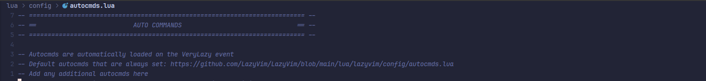
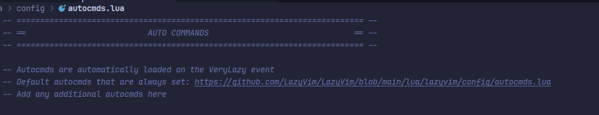

# HighlightURL

A simple plugin to highlight URLs in your buffer.
Minimal lua port of vim-highlighturl

## Installation

Using [lazy.nvim](https://github.com/folke/lazy.nvim) in lua

```lua

{
"rubiin/highlighturl.nvim",
event = "LazyFile",  -- load when entering a buffer
config = true,  -- use default settings
}
```

### Default Configuration

The plugin comes with the following default settings:
```lua
require("highlighturl").setup({
    ignore_filetypes = { "qf", "help", "NvimTree", "gitcommit" }, -- filetypes to skip
    highlight_color = "#5fd7ff",                                    -- URL highlight color
})
```

- You do not need to pass this unless you want to override defaults.

- Default behavior: highlights URLs in all buffers except ignored filetypes.

## Commands
- `:URLHighlightToggle` - Toggle URL highlighting on/off in the current buffer.


## Screenshots

### Before



### After


